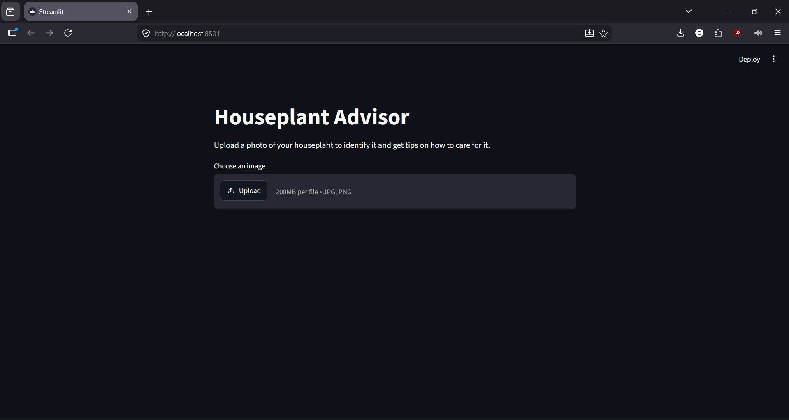
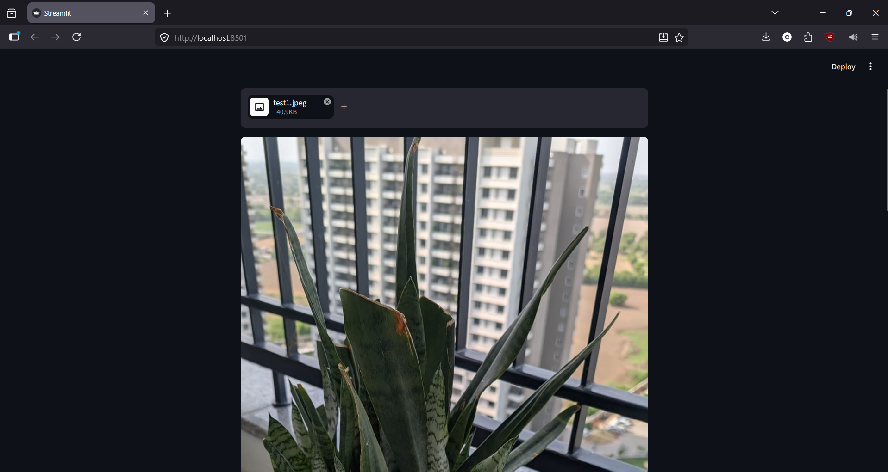
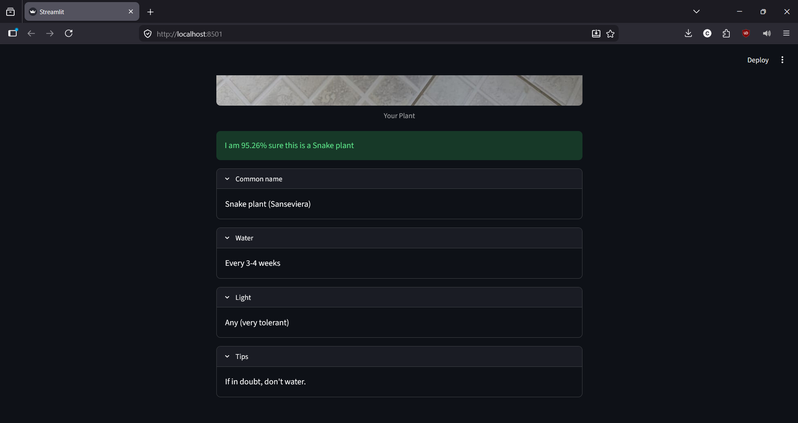

# Houseplant Identification Web App

A deep learning-powered web application that identifies houseplants from uploaded images and provides customized care instructions. Built with Streamlit and TensorFlow.

## Features
- **Accurate Identification:** Utilizes a custom-trained **ResNet50** model to classify 47 different species of common houseplants.
- **Detailed Care Guides:** Integrates with a custom database (`tips.csv` and `mapping.csv`) to provide specific watering, light, and maintenance instructions.
- **Reliability Guardrails:** Incorporates a confidence threshold to ensure uncertain predictions are flagged, prompting the user for a clearer image.
- **User-Friendly Interface:** Built on Streamlit for a fast, responsive, and intuitive experience.

## Screenshots
*(Make sure your screenshots are saved in this folder and match the filenames below)*


> *The main upload interface, prompting users for a clear, single-plant image.*


> *The identification result along with detailed care instructions.*

## Directory Structure

All files for this project are housed in a single root directory:

```text
├── app.py                             # Main Streamlit web application script
├── tips.csv                           # Database of plant care instructions
├── mapping.csv                        # Mapping of model class indices to plant names
├── model_training.ipynb               # Training pipeline, data augmentation, and sanitization
├── Screenshot 1.png                   # Screenshot of the upload interface
├── Screenshot 2.png 
├── Screenshot 3.png                   
├── Screenshot 4.png                   # Screenshot of the results interface
├── requirements.txt                   # Project dependencies (Streamlit, TensorFlow, etc.)
└── README.md                          # Project documentation (this file)
```

## Installation & Local Setup

1. **Clone the repository:**
   ```bash
   git clone [https://github.com/pranavSinghTehlan/Houseplant-Advisor.git](https://github.com/pranavSinghTehlan/Houseplant-Advisor.git)
   cd Houseplant-Advisor
   ```

2. **Create and activate a virtual environment:**
   ```bash
   python -m venv venv
   
   # On Windows:
   venv\Scripts\activate
   
   # On macOS/Linux:
   source venv/bin/activate
   ```

3. **Install the dependencies:**
   ```bash
   pip install -r requirements.txt
   ```

4. **Run the Streamlit app:**
   ```bash
   streamlit run app.py
   ```

## Model & Training Information
- **Architecture:** ResNet50 (Transfer Learning)
- **Classes:** 47 houseplant species
- **Dataset:** Sourced from Kaggle

## Usage Best Practices
For the most accurate results, users should:
- Ensure the photo contains **only one plant** at a time.
- Ensure good lighting and a clear view of the leaves.
- Avoid blurry images or pictures taken from extreme distances.

## Deployment
This project is configured for deployment on **Streamlit Community Cloud**.
